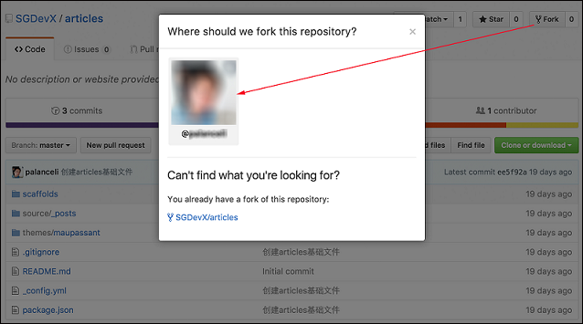
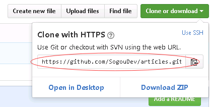
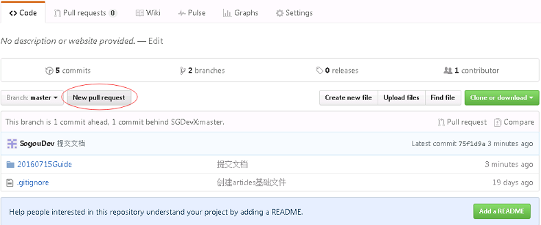
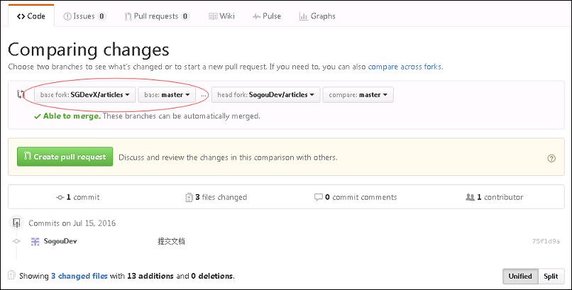
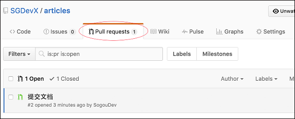

本文介绍拉取SGDevX/articles项目，并完成编辑、提交和推送的基本操作。

# 拉取SGDevX/articles到本地
## fork中央仓库到自己个人账户
注册一个GitHub账号，并在网页端登录。之后到[https://github.com/SGDevX/articles](https://github.com/SGDevX/articles) 点击右上角Fork按钮：

在弹出窗口上点击自己的账号，即可完成fork操作。

## 克隆个人仓库到本地
找到自己的个人仓库url：登录自己的GitHub，进入articles，点击“Clone or Download”

然后克隆该仓库：在windows下，安装[git for windows](https://git-for-windows.github.io/)，如果使用命令行，装这一个就足够了。如果使用GUI界面，可以再装一个[Tortoise Git](https://tortoisegit.org/) 。在macOS下我使用SourceTree。

之后就可以在本地Clone副本中编辑、修改以及提交。此时提交是提交到自己的个人仓库。

# 将个人仓库中的修改推送给中央仓库
登录自己的GitHub并进入articles项目，点击“New pull request”按钮：

在新的页面中，确认basefork中选择了中央仓库的主干，点击“Create pull request”：

填写提交说明，并点击“Create pull request”按钮，一个推送请求就完成了。

# 将推送请求合入主线
此时中央仓库将收到推送请求：

点击该条请求
